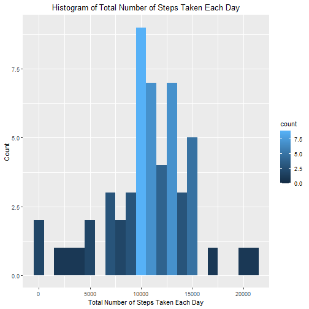
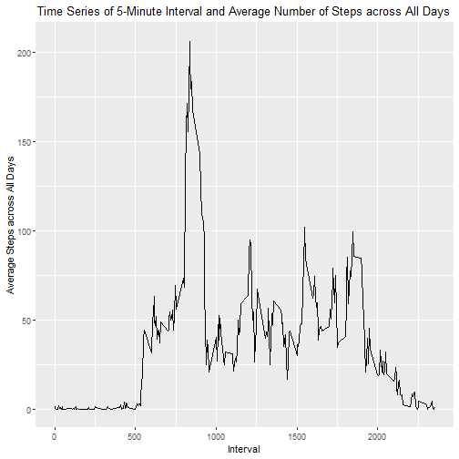
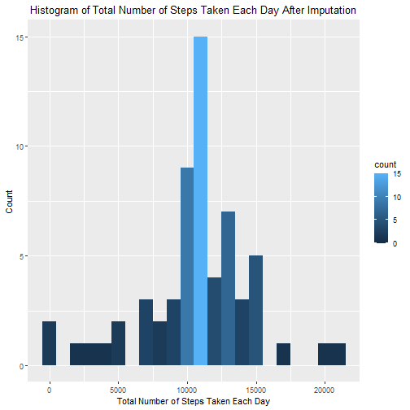
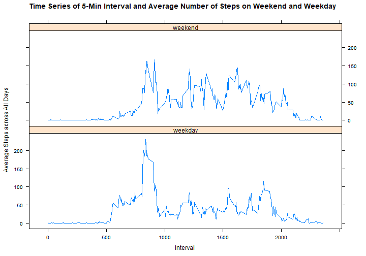

# Peer-graded Assignment: Course Project 1
Author: Kuang-Hsin Tien  
Date: 3 April 2022

### Introduction
It is now possible to collect a large amount of data about personal movement using activity monitoring devices such as a [Fitbit](https://www.fitbit.com/global/tw/home), [Nike Fuelband](https://www.nike.com/help/a/why-cant-i-sync), or [Jawbone Up](https://www.jawbone.com/search). These type of devices are part of the “quantified self” movement – a group of enthusiasts who take measurements about themselves regularly to improve their health, to find patterns in their behavior, or because they are tech geeks. But these data remain under-utilized both because the raw data are hard to obtain and there is a lack of statistical methods and software for processing and interpreting the data.

This assignment makes use of data from a personal activity monitoring device. This device collects data at 5 minute intervals through out the day. The data consists of two months of data from an anonymous individual collected during the months of October and November, 2012 and include the number of steps taken in 5 minute intervals each day.

The data for this assignment can be downloaded from the course web site:

* Dataset: [Activity monitoring data](https://d396qusza40orc.cloudfront.net/repdata%2Fdata%2Factivity.zip)[52K]

The variables included in this dataset are:

* steps: Number of steps taking in a 5-minute interval (missing values are coded as \color{red}{\verb|NA|}NA)

* date: The date on which the measurement was taken in YYYY-MM-DD format

* interval: Identifier for the 5-minute interval in which measurement was taken

The dataset is stored in a comma-separated-value (CSV) file and there are a total of 17,568 observations in this dataset.


### The R package needed for this project and language settings

```r
library(ggplot2)
library(lattice)
library(dplyr)
Sys.setlocale(category = "LC_ALL", locale = "english")
```


### Loading and preprocessing the data

```r
mydf <- read.csv("./activity.csv", header = TRUE, 
                 colClasses = c("numeric", "character", "numeric"),
                 na.strings = "NA")
mydf <- mutate(mydf, date=strptime(date, "%Y-%m-%d"))
```


### What is mean total number of steps taken per day?

```r
# Calculate the total number of steps taken per day
StepDay <- mydf %>% na.omit %>% group_by(date) %>% summarise(TotalStep=sum(steps))
# Make a histogram of the total number of steps taken each day
g1 <- ggplot(data=StepDay, aes(x=TotalStep, fill=..count..)) + 
     geom_histogram(binwidth = 1000) + 
     labs(title="Histogram of Total Number of Steps Taken Each Day") + 
     theme(plot.title = element_text(hjust = 0.5)) +
     labs(x="Total Number of Steps Taken Each Day") + 
     labs(y="Count")
print(g1)
```



```r
# mean total number of steps taken per day
mean(StepDay$TotalStep)
```

```
## [1] 10766.19
```

```r
# median total number of steps taken per day
median(StepDay$TotalStep)
```

```
## [1] 10765
```


### What is the average daily activity pattern?

```r
# Make a time series plot of the 5-minute interval (x-axis) and the average number of steps taken, averaged across all days (y-axis)
AvgStep <- mydf %>% na.omit %>% group_by(interval) %>% summarise(avgstep=mean(steps))
g2 <- ggplot(data=AvgStep, aes(x=interval, y=avgstep)) + 
      geom_line() + 
      labs(title="Time Series of 5-Minute Interval and Average Number of Steps across All Days") + 
      theme(plot.title = element_text(hjust = 0.5)) +
      labs(x="Interval") + 
      labs(y="Average Steps across All Days")
print(g2)
```



```r
# Which 5-minute interval, on average across all the days in the dataset, contains the maximum number of steps?
with(AvgStep, AvgStep[avgstep==max(avgstep), "interval", drop=TRUE])
```

```
## [1] 835
```


### Imputing missing values

```r
# Calculate and report the total number of missing values in the dataset (i.e. the total number of rows with NAs)
is.na(mydf) %>% sum()
```

```
## [1] 2304
```

```r
# Impute the missing data with mean for corresponding 5-minute interval and create the new dataframe "imputeMydf_2" with missing data filled in
imputeMydf_1 <- merge(mydf, AvgStep, by="interval", all=TRUE)
imputeMydf_2 <- mutate(imputeMydf_1, steps=ifelse(is.na(steps), avgstep, steps), avgstep=NULL)
# Make a histogram of the total number of steps taken each day and Calculate and report the mean and median total number of steps taken per day.
StepDayImpute <- imputeMydf_2 %>% group_by(date) %>% summarise(TotalStep=sum(steps))
g3 <- ggplot(data=StepDayImpute, aes(x=TotalStep, fill=..count..)) + 
    geom_histogram(binwidth = 1000) + 
    labs(title="Histogram of Total Number of Steps Taken Each Day After Imputation") + 
    theme(plot.title = element_text(hjust = 0.5)) +
    labs(x="Total Number of Steps Taken Each Day") + 
    labs(y="Count")
print(g3)
```



```r
# the mean and median total number of steps taken per day after imputation
mean(StepDayImpute$TotalStep)
```

```
## [1] 10766.19
```

```r
median(StepDayImpute$TotalStep)
```

```
## [1] 10766.19
```
Do these values differ from the estimates from the first part of the assignment? What is the impact of imputing missing data on the estimates of the total daily number of steps?  
Ans: The mean was unchanged, but the median became larger.


### Are there differences in activity patterns between weekdays and weekends?

```r
# Create a new factor variable in the dataset with two levels – “weekday” and “weekend” indicating whether a given date is a weekday or weekend day.
imputeMydf_3 <- mutate(imputeMydf_2, dayType=ifelse(weekdays(date) %in% c("Saturday", "Sunday"), "weekend", "weekday"))
# Make a panel plot containing a time series plot of the 5-minute interval (x-axis) and the average number of steps taken, averaged across all weekday days or weekend days (y-axis). 
AvgStepImpute <- imputeMydf_3 %>% group_by(interval, dayType) %>% summarise(avgstep=mean(steps))
xyplot(avgstep ~ interval|dayType, data=AvgStepImpute, type="l", layout=c(1,2),
       main="Time Series of 5-Min Interval and Average Number of Steps on Weekend and Weekday",
       xlab="Interval",
       ylab="Average Steps across All Days")
```


